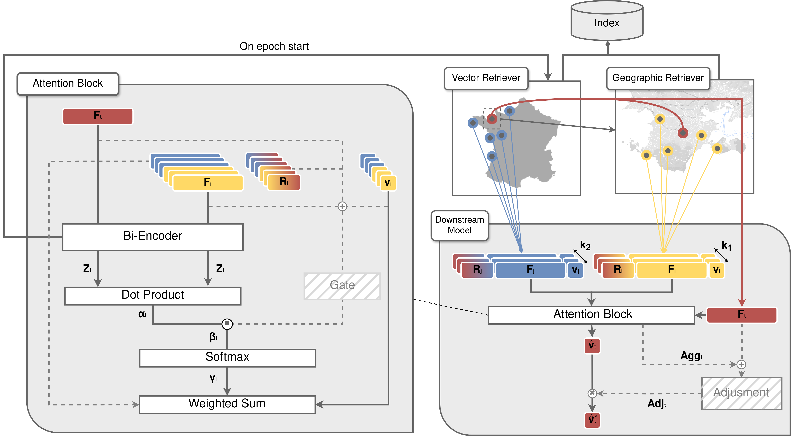

# Retrieval-Enhanced Real Estate Appraisal

<div align="center">

[](https://www.python.org)
[](https://pytorch.org)

</div>

<div style="width: 100%; height: 100px; overflow: hidden;">

</div>

## Description

This github repository contains the code and dataset introduced in the [Retrieval-Enhanced Real Estate Appraisal](https://nfmcp2024.di.uniba.it/papers/paper235.pdf) paper.

## Installation

You can install it a as module using pip:

```bash
pip install git+https://github.com/homiwoo/retrieval-enhanced-real-estate-appraisal
```

## Model

<div style="text-align: center;">
<table >
  <tr>
    <td></td>
    <td></td>
  </tr>
</table>
</div>

Both models introduced in the article: REA and EREA are made available:

```
retrieval_enhanced_real_estate_appraisal/
├─ model/
│  ├─ rea.py
│  ├─ erea.py
```

### Training

Training a model can be done using the `main.py` script:

```bash
python main.py
```

You can find more information about hyperparameters using:

```bash
python main.py --help
```

## Dataset

The Ille-et-Vilaine dataset introduced in the paper is available under `data/iv.csv`. It contains a scaled version of the dataset.
